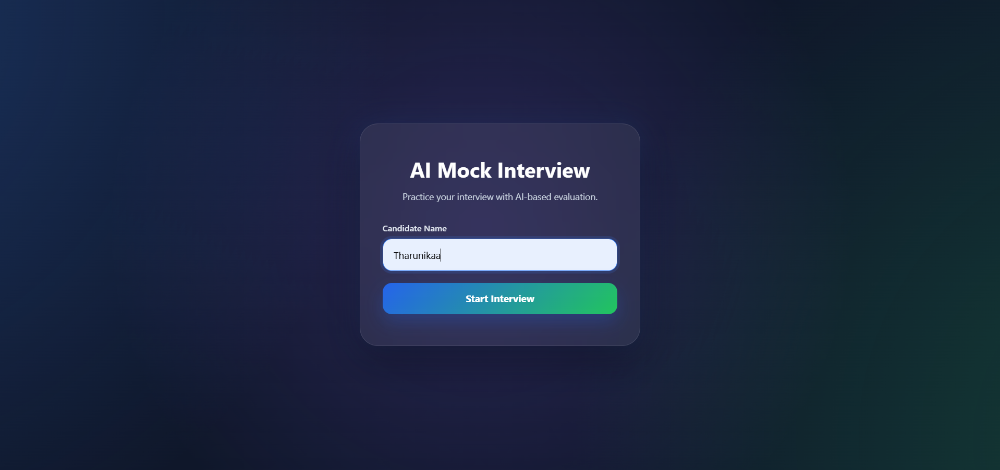
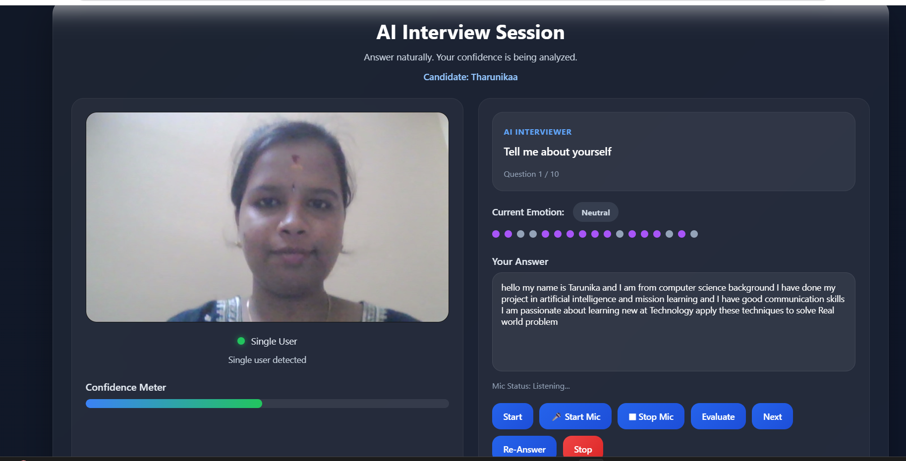
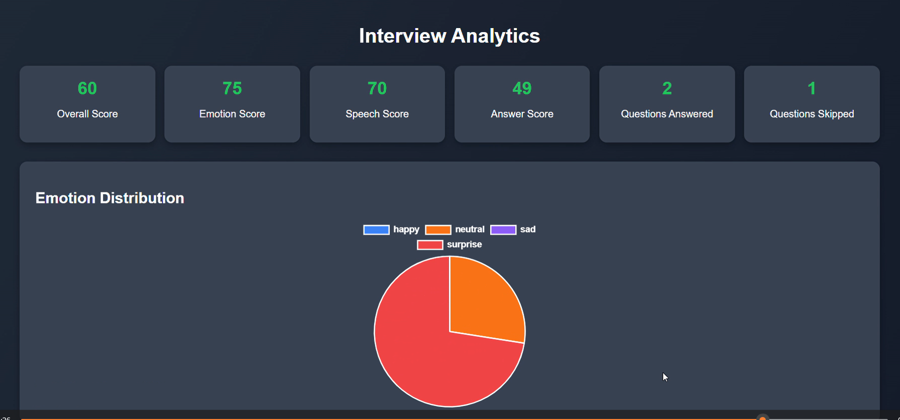
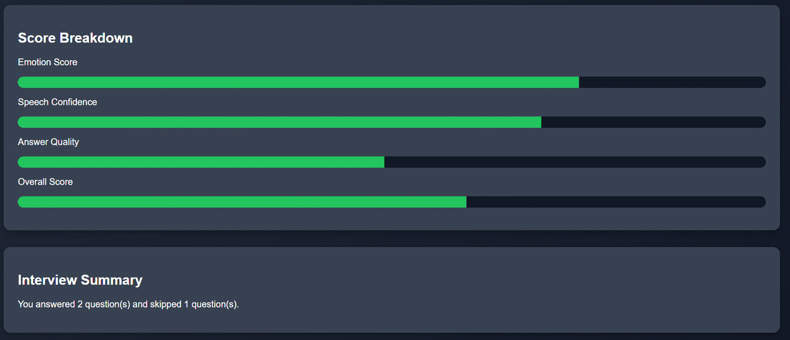
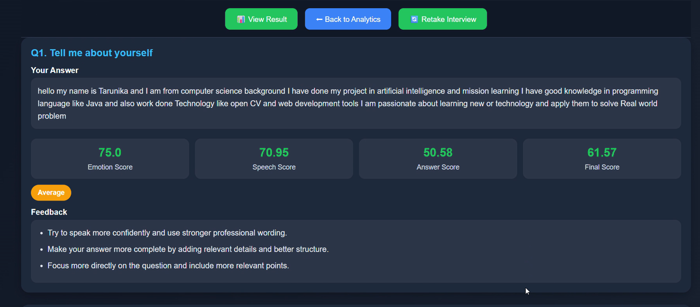
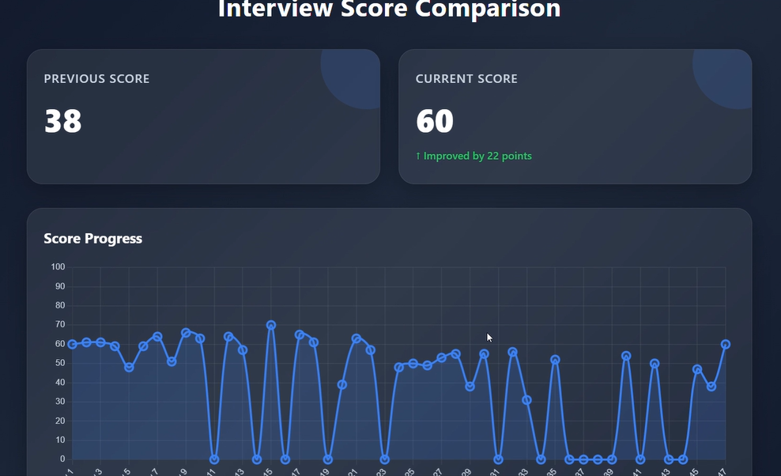

# Real-Time Emotion-Aware Interview Feedback System

## Project Overview

The **Real-Time Emotion-Aware Interview Feedback System** is an AI/ML-based web application designed to help candidates practice interviews and understand their overall interview performance.

The system evaluates a candidate from multiple aspects, including **facial emotion, answer quality, semantic relevance, communication confidence, and response structure**. It combines these evaluations to generate an overall performance score and personalized feedback.

The application uses a **Python Flask backend**, AI/ML modules, REST APIs, and an SQLite database to manage interview sessions and performance history.

---

## Problem Statement

Traditional interview practice mainly focuses on whether a candidate provides an appropriate answer. It may not provide comprehensive feedback about the candidate's communication style, facial emotions, answer structure, or areas that need improvement.

This project addresses this problem by providing a single platform that evaluates multiple aspects of interview performance and presents the results in an easy-to-understand format.

---

## Key Features

- 🎤 Interactive interview practice
- 📷 Real-time facial emotion detection
- 🧠 NLP-based answer evaluation
- 📝 Rule-based answer completeness analysis
- 💬 Semantic similarity analysis
- 💪 Communication confidence analysis
- 📊 Overall interview performance scoring
- 💡 Personalized feedback
- 📈 Question-level performance analytics
- 📋 Answered and skipped question tracking
- 📚 Previous interview performance history
- 🗄️ SQLite-based interview data storage
- 🌐 Flask REST API backend

---

## System Architecture

```text
                    Candidate
                       │
                       ▼
              Interview Questions
                       │
          ┌────────────┴────────────┐
          │                         │
          ▼                         ▼
     Webcam Frame              Spoken Answer
          │                         │
          ▼                         ▼
   Emotion Detection          Text Evaluation
          │              ┌──────────┼──────────┐
          │              │          │          │
          │             NLP    Completeness  Confidence
          │              │          │          │
          └──────────────┴──────────┴──────────┘
                              │
                              ▼
                       Scoring Engine
                              │
                              ▼
                     Overall Performance
                              │
                     ┌────────┴────────┐
                     ▼                 ▼
                 Feedback          Analytics
                     │                 │
                     └────────┬────────┘
                              ▼
                           SQLite
```

## 🤖 AI/ML Components

### 1. Facial Emotion Detection

The system captures webcam frames and sends them to the backend. OpenCV processes the image and passes it to the emotion detection model.

The system detects:

- Happy
- Neutral
- Sad
- Surprise
- Fear
- Angry

The detected emotions are tracked throughout the interview session.

---

### 2. Rule-Based Answer Completeness

The system checks whether the candidate's answer covers the important points related to the interview question.

It evaluates:

- Required content
- Word count
- Sentence structure
- Specific examples
- Professional vocabulary
- Generic or weak phrases

The result is a completeness score along with feedback.

---

### 3. NLP-Based Answer Evaluation

The project uses **Sentence Transformers with `all-MiniLM-L6-v2`** for semantic analysis.

The NLP module evaluates:

- Answer relevance
- Answer completeness
- Similarity with an ideal answer
- Assertiveness
- Hedging or uncertain language

Semantic similarity is calculated using sentence embeddings and cosine similarity.

---

### 4. Communication Confidence Analysis

The system evaluates the textual form of the candidate's spoken response.

It considers:

- Hedging words such as *"maybe"*, *"probably"*, and *"I think"*
- Assertive words such as *"implemented"*, *"achieved"*, and *"successfully"*
- Word count
- Sentence structure

These factors are combined to calculate a communication confidence score.

---

## 📊 Scoring System

The answer score combines two components:

```text
Answer Score
     │
     ├── 40% Rule-Based Completeness
     │
     └── 60% NLP Evaluation
```
---
### Feedback Generation

Feedback from the different evaluation modules is combined and converted into concise suggestions.

The system can provide feedback such as:

Improve confidence and professional wording
Add more relevant details
Structure the answer better
Focus more directly on the question
Avoid uncertain or weak expressions

Duplicate feedback is removed and the final feedback is limited to the most relevant suggestions.

## Web Application
### Frontend
- HTML5
- CSS3
- JavaScript

The frontend provides the interview interface, webcam interaction, results, analytics, and performance dashboard.

### Backend
- Python
- Flask
- Flask-CORS
- REST APIs

The Flask backend handles interview sessions, webcam frames, answer evaluation, scoring, database operations, and dashboard data.
---
## Outcomes

The project provides a complete web-based interview practice environment that evaluates multiple aspects of candidate performance and generates an overall score with actionable feedback.

It helps candidates identify areas such as:

- Answer relevance
- Answer completeness
- Communication confidence
- Professional expression
- Facial emotional patterns
- Overall interview performance
----
## Screenshots
## Application Screenshots

### 1. Login Interface


### 2. Emotion Detection


### 3. Answer Evaluation


### 4. Interview Results


### 5. Performance Analytics


### 6. Score Comparison

---

## Future Enhancements

- More diverse emotion datasets and improved emotion recognition accuracy
- Acoustic speech analysis using pitch, tone, pauses, and speaking rate
- Speech-to-text integration
- Resume-based interview questions
- Adaptive questions based on previous answers
- Larger-scale multi-user deployment
- Cloud-based deployment
- More advanced transformer-based answer evaluation
